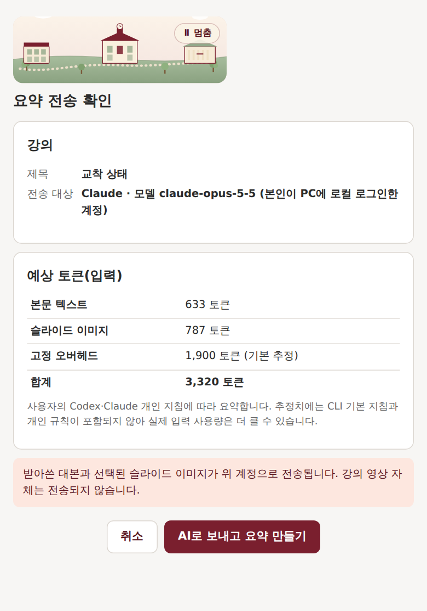
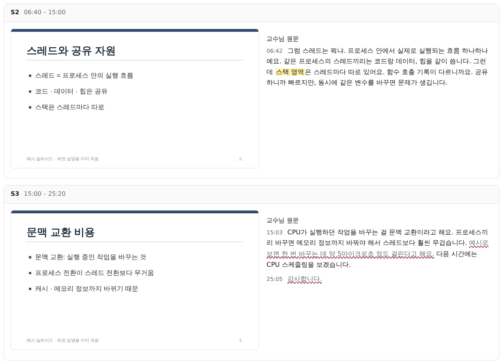

# klasnote (클라스노트)

광운대 KLAS 온라인 강의를 **받아쓰고 슬라이드와 묶어서, 복습용 HTML 파일 한 개**로 만들어 주는 Chrome 확장이에요.
원하면 내 Claude Code·Codex 계정으로 **강의 핵심과 시험 포인트**도 붙여 줘요.

> **비공식 개인 복습용 도구예요.** 학교와 관계없고, 출석·진도·인증에는 손대지 않아요.
> 쓰기 전에 **[사용 금지 사항](#9-사용-금지-사항-꼭-읽어-주세요)** 을 꼭 읽어 주세요. 사용하면 동의한 것으로 봐요.

### [⬇ 설치 파일 받기 — klasnote-0.1.5.zip (Windows · Mac 공용)](downloads/klasnote-0.1.5.zip?raw=true)


<sub>이 문서의 화면은 모두 **가상의 예시 강의**(운영체제(예시))를 넣고 실제 확장을 실행해 캡처한 거예요. 실제 강의 내용·교수님 정보는 들어 있지 않아요.</sub>

---

## 한눈에 보기

| 하는 일 | 설명 |
|---|---|
| 받아쓰기 | 강의 음성을 **Groq**(음성 인식 서비스)로 보내 글로 바꿔요. 내 PC에서 무거운 모델을 돌리지 않아요. |
| 슬라이드 | 화면이 바뀌는 순간을 골라 슬라이드 사진으로 저장해요. |
| AI 요약 (선택) | 내 Claude Code 또는 Codex 계정으로 강의 핵심·시험 포인트를 만들어요. 보내기 전에 꼭 물어봐요. |
| 결과 | 슬라이드 + 교수님 말씀 원문 (+ 요약)이 담긴 **HTML 파일 한 개**. 더블클릭하면 열리고, 인쇄하면 PDF가 돼요. |

**하지 않는 일:** 출석·진도 조작, 강의 영상 통째 저장, 개발자 서버로 데이터 보내기.

## 1. 준비물

| 필요한 것 | 설명 |
|---|---|
| **Google Chrome** | 최신 버전 |
| **Node.js LTS** | [nodejs.org](https://nodejs.org/)에서 설치. 설치 프로그램과 연결 프로그램이 써요. |
| **Groq API 키** (무료) | [Groq 키 발급 페이지](https://console.groq.com/keys)에서 Free 계정으로 만들어요. 개발자 공용 키는 없어요. |
| (선택) **Claude Code** 또는 **Codex** | AI 요약을 쓸 때만 필요해요. PC에 설치하고 로그인해 두세요. 기본 모델(Opus 5.5)은 Claude Code **2.1.280 이상**이 필요해요(`claude update`). |

## 2. 설치하기

웹스토어 등록 없이, ZIP을 받아 **내 Chrome에 한 번만 등록**하면 돼요.

### Windows
1. 받은 ZIP을 **오른쪽 클릭 → 모두 압축 풀기**. (ZIP 안에서 바로 실행하면 안 돼요)
2. 풀린 폴더의 **`install.cmd`** 를 더블클릭해요.
   - "Windows의 PC 보호" 창이 뜨면 **추가 정보 → 실행**.
   - 끝나면 확장 폴더 경로가 **클립보드에 복사**되고 그 폴더가 열려요.
3. Chrome 주소창에 `chrome://extensions` → 오른쪽 위 **개발자 모드** 켜기
4. **압축해제된 확장 프로그램을 로드합니다** → 폴더 선택 창 위쪽 주소칸에 **Ctrl+V** → Enter → **폴더 선택**
   - 경로: `%LOCALAPPDATA%\KlasSummarizer\extension`
   - 한 단계 위 `KlasSummarizer` 폴더를 고르면 "manifest 파일이 없다"는 오류가 나요.
5. 목록에서 **klasnote**가 켜져 있으면 끝이에요. 이미 열어 둔 KLAS 페이지는 새로고침(F5)하세요.

### Mac
1. 받은 ZIP을 더블클릭해 풀어요.
2. **터미널**에 `sh ` (sh + 띄어쓰기)를 입력하고, 풀린 폴더의 **`install.command`** 를 터미널 창으로 끌어다 놓은 뒤 Enter.
3. Chrome에서 `chrome://extensions` → **개발자 모드** 켜기 → **압축해제된 확장 프로그램을 로드합니다**
4. 폴더 선택 창에서 **Cmd+Shift+G** → **Cmd+V**(경로가 복사돼 있어요) → 이동 → **선택**
   - 경로: `~/Library/Application Support/KlasSummarizer/extension`
5. klasnote가 켜져 있는지 확인하고, 열어 둔 KLAS 페이지를 새로고침하세요.

> Mac은 코드와 자동 테스트로만 확인했고 **실제 Mac 기기에서는 아직 확인하지 못했어요.** 문제가 있으면 알려 주세요.

> **설치 파일은 꼭 탐색기(Finder)에서 직접 실행하세요.** Claude 데스크톱 앱 같은 다른 프로그램 안에서 실행하면 Chrome이 연결 프로그램을 찾지 못해요.

<details><summary>개발자 모드를 켜기 싫다면: 전용 Chrome 창 방식</summary>

`start.cmd`(Mac은 `start.command`)를 실행하면 확장이 켜진 **KLAS 전용 Chrome 창**이 열려요. 대신 매번 이 파일로 열어야 하고, 그 창에서 KLAS에 따로 로그인해야 해요.
</details>

## 3. 처음 설정


처음 실행하면 처리 방식을 고르는 화면이 떠요.

| 선택 | 하는 일 | AI 사용량 |
|---|---|---|
| **원문만** | 받아쓰기 + 슬라이드로 HTML을 만들어요. (패널에는 "로컬 전용"으로 표시돼요) | 0 |
| **AI 모드** | 위 내용 + 강의 핵심·시험 포인트 | 강의 1개당 수만 토큰(추정, 아래 FAQ 참고) |

그다음 **설정 → Groq 받아쓰기**에서:
1. 발급받은 API 키를 붙여 넣고
2. **음성 전송 동의**에 체크한 뒤 **키·동의 저장**
3. **연결 테스트·대기 재개**를 눌러 "연결 성공"이 나오면 준비 끝이에요.


- 키는 내 PC의 연결 프로그램 폴더에만 저장돼요. Chrome 저장소·결과 HTML·배포 ZIP에는 들어가지 않아요.
- **유료 플랜 키를 넣으면 비용이 생길 수 있어요.** 무료로 쓰려면 Groq 계정이 Free 플랜인지 확인하세요.
- Groq 무료 기본 한도는 음성 **시간당 2시간, 하루 8시간**이에요([계정별 실제 한도](https://console.groq.com/settings/limits)가 우선). 한도를 넘으면 멈추지 않고 기다렸다가 이어서 처리해요.

## 4. 사용하기

### ① 강의 목록에서 시작하기

KLAS **온라인 강의 목록**의 각 `보기` 버튼 아래에 클라스노트 버튼이 생겨요.


<sub>위 화면은 설명용 예시 목록 페이지에 실제 확장 버튼이 붙은 모습이에요.</sub>

| 버튼 | 하는 일 |
|---|---|
| **자동 처리** | 켜 둔 강의는 `보기`로 열 때 자동으로 받아쓰기를 시작해요. 기본은 꺼짐. |
| **지금 요약** | 지금 바로 받아쓰기를 시작해요. **한 번이라도 들은 강의**(KLAS 진도가 있는 강의)만 눌려요. |
| **확인하고 저장** | 받아쓰기가 끝난 강의. 보낼 내용과 예상 사용량을 확인한 뒤 요약 노트를 만들어요. |
| **HTML 받기** | AI 요약 없이 원문 + 슬라이드 HTML을 바로 받아요. 토큰 0. |

- 처리는 강의 재생과 **따로** 돌아가요. 배속으로 보거나 강의 창을 닫아도 Chrome만 켜져 있으면 계속돼요.
- 처리 중에는 KLAS 화면 위쪽에 **"클라스노트 · 처리 중"** 표시가 떠요. 누르면 진행 패널이 열리고, 끌어서 옮길 수 있어요.

### ② 진행 상황 보기


Chrome 오른쪽 위 **klasnote 아이콘**(또는 KLAS 화면의 "클라스노트" 표시)을 누르면 패널이 열려요.

| 상태 | 뜻 / 할 일 |
|---|---|
| **처리 중** | 진행률과 **방금 받아쓴 문장**이 1~2분마다 바뀌어요. 녹음이 잘 되는지 여기서 확인하세요. |
| **확인 필요** | 받아쓰기 끝. **확인하고 저장**(요약) 또는 **HTML 받기**(원문만) 중에 고르세요. |
| **오류** | 이유가 쉬운 말로 나와요. **다시 시도**를 누르면 멈춘 곳부터 이어서 해요. 요약만 실패했다면 **HTML 받기**로 원문은 받을 수 있어요. |
| **완료** | **HTML 다시 저장**으로 언제든 다시 받아요(AI 다시 안 불러요). |

### ③ 요약 보내기 전 확인



AI 모드에서 **확인하고 저장**을 누르면, AI로 보내기 전에 **어떤 계정·모델로, 얼마나** 보내는지 보여 줘요. **AI로 보내고 요약 만들기**를 눌러야만 전송돼요.
(이 확인을 끄려면 설정의 **전송 전 확인**을 해제하세요. 기본은 켜짐이에요.)

### ④ 결과 HTML 읽기

결과는 **다운로드 폴더 → `KLAS요약/<과목>/<주차>_<강의명>.html`** 에 저장돼요.



- **함께 보기 / 요약만 / 원문만** 버튼으로 보는 방식을 바꿀 수 있어요.
- <mark>노란 표시</mark>: AI가 슬라이드·문맥을 보고 고친 말이에요. 마우스를 올리면 원래 받아쓴 말과 근거 슬라이드가 보여요.
- **물결 밑줄**: **확인 필요.** 음성 인식이 지어냈을 수 있는 말(조용할 때 생기는 "감사합니다." 같은 말, 반복, 말한 시간에 비해 너무 긴 문장)이나, **숫자를 다시 받아썼더니 다르게 나온 문장**이에요. 시험에 나올 숫자는 꼭 강의로 확인하세요.
- 받아쓰기와 AI 요약은 틀릴 수 있어요. 헷갈리면 원문·슬라이드·강의로 확인하세요.

## 5. 내 데이터는 어디로 가나요?

| 데이터 | 가는 곳 |
|---|---|
| 강의 음성(짧은 구간 단위) | **Groq** (내 API 키로). Groq의 데이터 정책이 적용돼요. |
| 받아쓴 원문 + 일부 슬라이드 | **AI 모드에서 확인을 눌렀을 때만** 내 Claude/Codex 계정으로 |
| 받아쓰기·슬라이드·요약 기록 | 내 PC의 Chrome 저장소 |
| 결과 HTML | 내 PC 다운로드 폴더 |
| 개발자에게 | **아무것도 보내지 않아요.** 공유 서버나 공용 캐시가 없어요. |

강의 영상 파일은 저장하지 않아요. 영상 서버에서 필요한 구간만 읽어 음성과 슬라이드 사진만 남겨요.

## 6. 자주 묻는 질문

**Q. 매번 뭔가 실행해야 하나요?**
아니요. 한 번 등록하면 끝이에요. Chrome이 켜져 있는 동안 처리돼요. (전용 창 방식만 매번 `start`로 열어요)

**Q. 노트북이 느려지지 않나요?**
음성 인식은 Groq 서버에서 해서 거의 부담이 없어요. 실측으로 처리 중 Chrome CPU 평균 약 2%, 55분 강의 받아쓰기에 약 6~7분 걸렸어요.

**Q. 출석에 영향이 있나요?**
없어요. 플레이어를 건드리지 않아요. 출석은 평소처럼 KLAS에서 강의를 들어야 인정돼요.

**Q. 토큰(AI 사용량)이 많이 드나요?**
받아쓰기는 Groq 무료 한도만 쓰고 AI 토큰은 0이에요. AI 요약은 1시간 강의 기준 입력 약 4만·출력 약 5천 토큰으로 추정하지만, CLI가 내 개인 지침(CLAUDE.md 등)도 함께 읽기 때문에 실제로는 더 많을 수 있어요. 같은 강의를 다시 받을 때는 0이에요.
숫자 재확인과 구간 겹침 때문에 Groq 음성 한도는 강의 길이보다 조금 더 써요(숫자가 많은 강의는 최대 30~40%).

**Q. 요약은 어떤 기준으로 만드나요?**
슬라이드마다 따로 요약하지 않고, 강의 전체에서 교수님이 강조하거나 반복한 내용을 주제별로 모아요. 시험 포인트는 `[시험 언급]`·`[중요 강조]`·`[복습 추천]`으로 나누고 근거 슬라이드 번호와 시간을 붙여요. 말투·분량은 내 Claude/Codex 개인 지침을 따라요.

**Q. 요약할 때 AI가 내 파일을 건드리지 않나요?**
요약은 매번 새 빈 임시 폴더에서 실행하고, 파일·명령 실행 도구와 MCP는 꺼 둬요. Claude 자동 훅도 이 실행에서는 꺼요.

**Q. "Claude Code가 오래되어 선택한 모델을 쓸 수 없습니다"가 떠요.**
터미널에서 `claude update`를 실행한 뒤 **다시 시도**를 누르세요.

**Q. "페이지를 새로고침(F5)한 뒤 다시 눌러 주세요"가 떠요.**
확장을 새로 설치하거나 업데이트하면 이미 열린 KLAS 페이지와 연결이 끊겨요. F5로 새로고침하면 돼요.

**Q. 설정의 "자동 감지"에서 Claude/Codex가 안 나와요.**
`install`을 탐색기(Finder)에서 직접 다시 실행해 주세요.

**Q. "저장된 받아쓰기가 없어요"가 떠요.**
다른 Chrome 프로필에서 처리했거나 기록이 지워진 경우예요. **지금 요약**으로 다시 받아쓰면 돼요.

## 7. 업데이트

1. 진행 중인 처리가 끝날 때까지 기다려요.
2. 새 ZIP을 풀고 `install`을 다시 실행해요.
3. `chrome://extensions`에서 klasnote의 **새로고침(↻)** 을 누르고, 열린 KLAS 페이지도 **F5**.

같은 설치 폴더를 쓰니까 확장을 지우거나 다시 등록할 필요는 없어요.

## 8. 제거

1. 먼저 **설정 → 내 강의 기록**에서 강의별 **삭제**로 기록을 지워요. (이미 받은 HTML 파일은 남아요)
2. `chrome://extensions`에서 klasnote **삭제**
3. Windows: 폴더의 `uninstall.ps1`을 오른쪽 클릭 → PowerShell에서 실행 / Mac: 터미널에서 `sh uninstall.command`

## 9. 사용 금지 사항 (꼭 읽어 주세요)

강의 영상·슬라이드·교수님 말씀은 **교수자와 학교의 저작물**이고, 강의에는 다른 학생의 목소리·이름 같은 **개인정보**가 섞일 수 있어요. 이 도구는 **본인이 수강 중인 강의를 본인만 복습**하는 데에만 쓸 수 있어요. 아래 행동은 하지 마세요.

**결과물 공유·배포 금지**
- 만든 HTML·대본·슬라이드 이미지·요약을 다른 사람에게 보내기, 단톡방·커뮤니티·SNS·블로그·자료 공유 사이트·클라우드 공유 링크에 올리기
- 결과물이나 이 도구로 만든 정리본을 팔거나 대가를 받고 주기 등 **영리 목적 이용**
- 결과물을 편집해 자기 저작물처럼 공개하기

**강의 영상 자체 보관·유출 금지**
- 이 도구나 코드를 고쳐 강의 영상·음성 파일을 통째로 저장·보관·배포하기 (이 도구는 영상을 저장하지 않고 받아쓰기·슬라이드 사진만 PC에 남겨요)
- 여러 강의를 한꺼번에 받도록 고치는 등 학교 서버에 과도한 부하를 주는 사용

**계정·학사 관련 금지**
- 다른 사람의 KLAS 계정으로 쓰기, 내 계정을 빌려주기, 수강하지 않는 강의에 쓰기
- 교수자가 녹음·녹취·받아쓰기(전사)를 금지한 수업에서 쓰기
- 출석·진도·학습 시간을 속이거나, 강의를 듣지 않고 들은 것처럼 보이려는 목적으로 쓰기 (출석은 KLAS에서 직접 들어야 인정돼요)
- 시험·과제·퀴즈 부정행위 (요약 결과를 과제로 그대로 내기, 시험 중 사용 등). 수업별 AI 이용 규정이 있으면 그 규정을 따르고, AI를 금지한 수업에서는 AI 모드를 쓰지 마세요.

**다른 사람의 권리·약관**
- 강의에 나온 다른 학생의 이름·목소리·발언을 따로 정리해 공유하기
- AI 모드는 내 Claude·Codex 계정의 이용약관을 따라요. 계정 공유 등 약관을 어기는 사용 금지

**도구 재배포**
- 이 도구를 고쳐 다시 배포하면서 이 금지 사항을 빼거나, 출석 조작·영상 저장·대량 수집 같은 기능을 넣기

**책임 한계**
- 이 도구는 학교와 관계없는 **비공식** 도구이며, 결과가 정확하거나 학교 규정에 맞는다고 보증하지 않아요. 사용 책임은 사용자에게 있어요.
- 학교·교수자가 사용 중단을 요청하면 바로 사용을 멈추고 저장한 결과물을 지워 주세요.
- 학교의 AI 이용 허가는 받지 않았어요.
- 이 안내는 법률 자문이 아니에요. 애매하면 학교(교수자)에 먼저 확인하세요.

## 10. 확인된 것과 한계 (v0.1.5, 2026-10-05)

- 자동 테스트 113개 통과 (Groq 연결·한도·키 보호, 구간 겹침, 교정 표시, 숫자 재확인, 요약 없는 HTML 받기 등).
- Windows 실사용(Core Ultra 5 225H, 16GB): 55분 강의 받아쓰기 약 6~7분, 처리 중 Chrome CPU 평균 약 2%.
- 구간을 나눠 받아쓴 결과와 한 번에 받아쓴 결과를 비교해, 경계에서 빠지거나 겹친 문장이 없음을 확인했어요.
- 한계: 숫자 재확인은 같은 모델로 하기 때문에 같은 실수를 반복하면 못 잡아요. "십 퍼센트"처럼 한글로 받아쓴 숫자는 확인하지 않아요.
- 아직 확인 못 한 것: 실제 Mac 기기, 조용한 구간 직후의 시간 오차가 슬라이드 정렬에 주는 영향, KLAS Helper와 함께 쓸 때의 전체 흐름.

<details><summary>개발자용</summary>

```
npm ci
node scripts/vendor.mjs          # 처리 라이브러리를 extension/vendor로 복사
npm test                         # 테스트
node scripts/build-package.mjs   # downloads/klasnote-<버전>.zip 생성
```
화면 예시 이미지는 가상의 예시 강의 데이터를 넣고 실제 확장 화면을 캡처한 거예요. 실제 강의 결과물이나 교수님 정보를 README·ZIP에 넣지 마세요.
</details>
