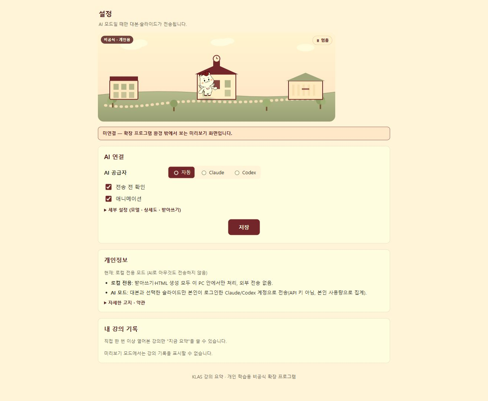

# 클라스노트

직접 열어 본 KLAS 강의를 받아쓰고, 슬라이드와 함께 개인 복습용 HTML로 저장합니다.

[Windows 설치 ZIP 다운로드](downloads/klasnote-windows.zip?raw=true)

## 설치

Windows, Chrome 116 이상, [Node.js LTS](https://nodejs.org/)가 필요합니다.

1. 설치 ZIP을 **모두 압축 해제**하고 `install.cmd`를 더블클릭합니다. 우니 이미지와 처리 라이브러리가 포함돼 있어 `npm install`은 필요 없습니다.
2. 설치가 끝나면 Chrome 확장 관리 화면과 설치 폴더가 열립니다.
3. Chrome에서 **개발자 모드 → 압축해제된 확장 프로그램을 로드**를 누르고 열린 `extension` 폴더를 선택합니다.
4. 처음 설정에서 **로컬 전용 → 계속**을 누릅니다. AI가 필요하면 AI 모드를 선택합니다.

설치 위치는 `%LOCALAPPDATA%\KlasSummarizer\extension`입니다. 관리자 권한은 필요 없습니다. 업데이트는 새 ZIP의 `install.cmd`를 실행한 뒤 확장 관리 화면에서 **새로고침**합니다. Chrome은 확장을 자동 등록할 수 없어 3번은 직접 해야 합니다. 보안 경고가 나오면 경고를 우회하지 말고 설치를 멈추세요.

소스 ZIP에는 처리 라이브러리가 없습니다. 개발용 설치는 `npm ci` → `node scripts/vendor.mjs` → `install.cmd` 순서입니다.

## 사용

1. KLAS 강의 목록에서 **보기**로 강의를 한 번 엽니다.
2. 해당 강의의 **지금 요약**을 누릅니다. **자동 처리**는 강의마다 기본 OFF이며, 켜면 다음에 직접 열 때 처리합니다.
3. 받아쓰기가 끝나면 **확인하고 저장**을 누릅니다. 결과는 `다운로드/KLAS요약/<과목>`에 저장됩니다.

기본 화면에는 작은 상태 표시만 있습니다. 상태 표시나 Chrome 확장 아이콘을 누르면 오른쪽 패널이 열립니다. 패널을 닫아도 처리는 계속되며, 완료됐다고 자동으로 열리지 않습니다. 패널의 **사용방법**, **설정**에서 도움말과 설정을 확인합니다. 우니 모션은 끌 수 있고, 숨겨진 화면에서는 멈춥니다.

로컬 전용은 받아쓰기·슬라이드를 저장합니다. AI 요약은 로그인한 **Claude Code 또는 Codex CLI**가 필요하며 API 키는 쓰지 않습니다. AI 모드에서는 전송량을 확인한 뒤 대본과 선택한 슬라이드가 본인 서비스로 전송됩니다. 전송 전 확인은 기본 ON입니다. OFF로 바꾸고 자동 처리를 켜면 별도 확인 없이 본인 사용량을 씁니다. 저장된 요약을 다시 내려받을 때는 AI를 재호출하지 않습니다.

## 유의사항

- 모델은 처음 사용할 때 다운로드합니다. 강의 길이와 PC 성능에 따라 처리 시간이 달라집니다. 중지는 현재 구간 처리가 끝난 뒤 반영될 수 있습니다.
- 받아쓰기·AI 요약은 틀릴 수 있으므로 원문과 슬라이드를 확인하세요. 중지해도 이미 사용한 AI 사용량은 돌아오지 않습니다.
- 강의 기록은 브라우저에 저장하며 공유 서버·공동 캐시·공유 기능은 없습니다. HTML에 원문·슬라이드가 포함되므로 개인 복습용으로 사용하세요. 다운로드한 HTML은 강의 기록을 삭제해도 남습니다.
- 출석·진도·인증은 변경하지 않습니다. 클라스헬퍼와 변수·스타일을 분리했지만 실제 강의 화면에서의 동시 사용 전체 흐름은 아직 미검증입니다.
- 학교의 AI 이용 허가와 우니 사용 승인은 받지 않았습니다. 우니 이미지의 권리는 학교에 있습니다. [공식 마스코트 안내](https://news.kw.ac.kr/mascot/mascot.html).

## 화면

아래는 기존 설정 화면의 브라우저 미리보기입니다. 실제 설치·패널 실행 완료를 입증하는 캡처는 아닙니다.

## 검증

기존 테스트 16개와 합성 브라우저 데이터 검사 8개, 실제 Chrome 154 확장 등록·서비스 워커·저장소 유지 검사를 통과했습니다. 이번에는 백엔드 14개와 설치 안전성 3개를 다시 확인하고 설치 묶음의 필수 파일을 검사했습니다.

실제 Chrome 패널 화면, 강의 한 편 전체 처리, Chrome 네이티브 연결부터 HTML 다운로드까지, 클라스헬퍼의 실제 강의 화면 동시 동작, 최대 GPU·메모리는 미검증입니다. [인계 문서](HANDOFF.md)에 상세 상태가 있습니다.

현재 사용자 호스트 제거는 `uninstall.ps1`로, 확장 제거는 Chrome 확장 관리 화면에서 합니다.
