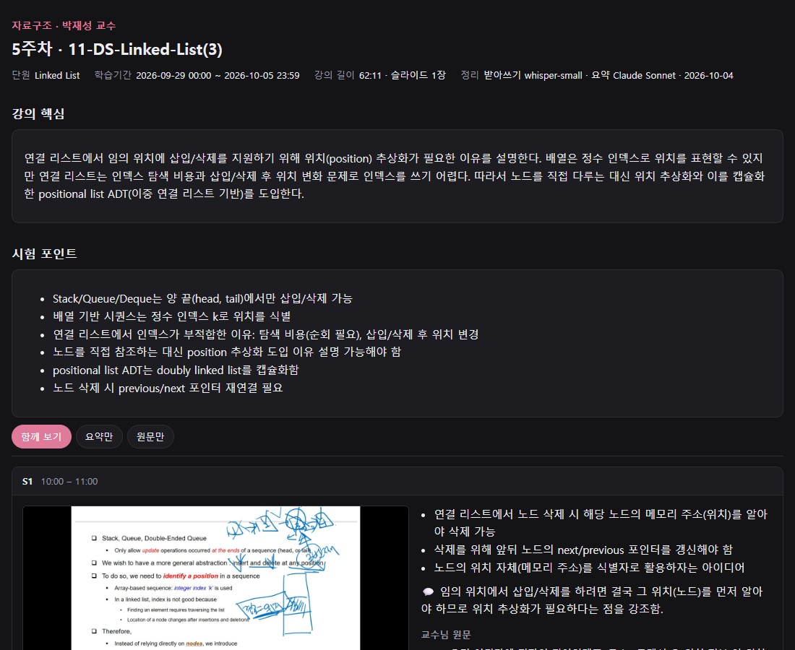
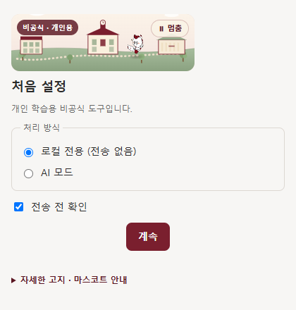
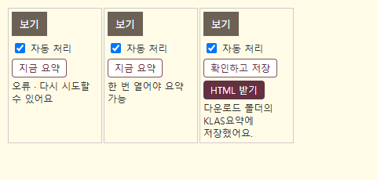
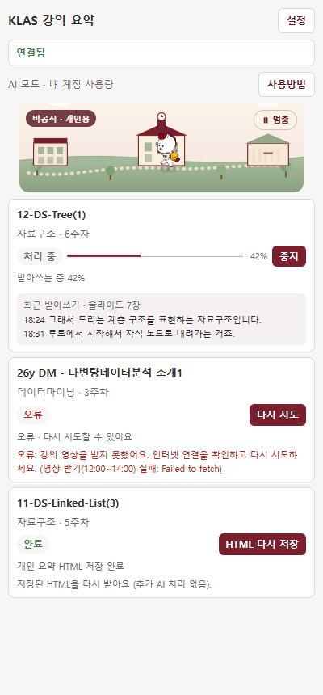
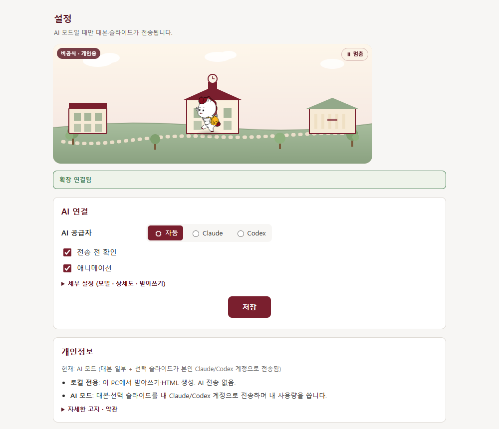

# 클라스노트 · KLAS 강의 요약

광운대 KLAS 온라인 강의를 **내 PC에서 받아쓰고**, 슬라이드와 함께 **복습용 HTML 한 파일**로 정리해 주는 Chrome 확장입니다.
원하면 내 Claude Code 또는 Codex 계정으로 요약·시험 포인트까지 붙여 줍니다(API 키 필요 없음).

> 비공식 개인 학습용 도구입니다. 출석·진도·인증에는 손대지 않습니다.

### [⬇ 설치 파일 받기 — klasnote-0.1.3.zip (Windows · Mac 공용)](downloads/klasnote-0.1.3.zip?raw=true)



---

## 1. 준비물

| 필요한 것 | 설명 |
|---|---|
| **Google Chrome** | 최신 버전 |
| **Node.js LTS** | [nodejs.org](https://nodejs.org/)에서 LTS 버전 설치 (설치 프로그램과 AI 연결에 씀) |
| (선택) **Claude Code** 또는 **Codex** | AI 요약을 쓰려면 PC에 설치하고 로그인해 두세요. 없어도 받아쓰기·슬라이드 정리는 됩니다. |

## 2. 설치하고 실행하기

### Windows
1. 받은 ZIP을 **마우스 오른쪽 → 모두 압축 풀기**로 풉니다. (ZIP 안에서 바로 실행하면 안 돼요)
2. 풀린 `klasnote` 폴더의 **`start.cmd`** 를 더블클릭합니다.
   - 처음 한 번은 자동으로 설치하고, 확장이 켜진 **KLAS 전용 Chrome 창**이 열립니다.
   - "Windows의 PC 보호" 창이 뜨면 **추가 정보 → 실행**을 누르세요.
3. 열린 창에서 **KLAS에 로그인**합니다. (평소 Chrome과 다른 창이라 로그인을 한 번 따로 해야 해요)

### Mac
1. 받은 ZIP을 더블클릭해 풉니다.
2. **터미널**을 열고 `sh ` (sh와 띄어쓰기)를 입력한 뒤, 풀린 폴더의 **`start.command`** 파일을 터미널 창으로 끌어다 놓고 Enter를 누릅니다.
   - Finder에서 `start.command`를 **오른쪽 클릭 → 열기**로 실행해도 됩니다.
3. 열린 KLAS 전용 Chrome 창에서 KLAS에 로그인합니다.

> Mac 지원은 코드와 자동 테스트로 확인했고, **실제 Mac 기기에서는 아직 검증 전**입니다. 문제가 있으면 알려 주세요.

**다음부터는** 같은 `start.cmd`(Mac은 `start.command`)만 실행하면 됩니다. 설치 위치: Windows `%LOCALAPPDATA%\KlasSummarizer`, Mac `~/Library/Application Support/KlasSummarizer` (관리자 권한 필요 없음)

## 3. 처음 설정



| 선택 | 하는 일 | 토큰(AI 사용량) |
|---|---|---|
| **로컬 전용 (전송 없음)** | AI 없이 받아쓰기 원문 + 슬라이드만 HTML로 정리. 어디에도 전송하지 않아요. *(PC에 AI 모델을 따로 설치하는 방식이 아니에요)* | 0 |
| **AI 모드** | 위 내용 + 내 Claude/Codex 계정으로 요약·시험 포인트 추가 | 강의 1개당 약 4만 토큰(추정) |

**전송 전 확인**을 켜 두면 AI로 보내기 전에 예상 사용량을 보여 주고 물어봅니다(기본 켜짐).

## 4. 강의 정리하기

KLAS **온라인 강의 목록**의 각 강의 `보기` 버튼 아래에 클라스노트 버튼이 생깁니다.



| 버튼 | 설명 |
|---|---|
| **자동 처리** 스위치 | 켜 둔 강의는 `보기`로 열 때 자동으로 받아쓰기를 시작해요. 기본은 꺼짐이라, 원치 않는 강의에 토큰이 쓰이지 않아요. |
| **지금 요약** | 이 강의를 바로 처리해요. (강의를 `보기`로 한 번은 열어 봐야 눌려요) |
| **확인하고 저장** | 받아쓰기가 끝난 강의. 눌러서 확인 후 HTML을 저장해요. |
| **HTML 받기** | 끝난 강의의 HTML을 다시 받아요. AI를 다시 부르지 않아 토큰 0. |

- 처리는 강의 재생과 **따로** 진행돼요. 배속으로 보거나 강의 창을 닫아도, KLAS 전용 Chrome이 열려 있으면 처리는 이어져요.
- 화면 위쪽의 **"클라스노트 · 처리 중"** 표시를 누르면 진행 패널이 열려요. 표시가 거슬리면 **끌어서 옮길 수 있어요**(위치 기억).
- 결과 파일은 **다운로드 폴더 → `KLAS요약/<과목>/<주차>_<강의명>.html`** 에 저장돼요. 더블클릭하면 열리고, 인쇄하면 PDF로 저장할 수 있어요.

## 5. 진행 상황 보기 (오른쪽 패널)



- **처리 중**: 진행률과 **방금 받아쓴 문장**이 1~2분마다 갱신돼요. 녹음이 잘 되고 있는지 여기서 확인하세요.
- **오류**: 이유가 쉬운 말로 나오고, **다시 시도**를 누르면 멈춘 지점부터 이어서 처리해요.
- **완료**: **HTML 다시 저장**으로 언제든 다시 받을 수 있어요.

## 6. 설정



- **AI 공급자**: 자동 / Claude / Codex. Codex는 `gpt-5.6-terra` 모델로 고정이에요.
- **세부 설정**: Claude 모델(기본 Sonnet), 요약 상세도(절약·표준·상세), 받아쓰기 모델(기본 small, 느린 PC는 base)
- **자동 감지**: Claude/Codex 설치 여부만 확인(토큰 0). **연결 테스트**는 실제 AI를 1번 불러요(약 2천 토큰).

## 7. 자주 묻는 질문

**Q. 실행기(start)를 매번 눌러야 하나요?**
KLAS 전용 Chrome 창이 열려 있는 동안은 계속 작동해요. 그 창을 모두 닫았다면 다음에 다시 `start`를 실행하세요. 처리는 그 창이 열려 있을 때만 진행됩니다.

**Q. 평소 쓰는 Chrome에 바로 깔 수는 없나요?**
Chrome은 웹스토어를 거치지 않은 확장의 자동 설치를 막아요. 그래서 지금은 전용 창 방식입니다. (직접 하려면 `chrome://extensions` → 개발자 모드 → "압축해제된 확장 프로그램 로드" → 설치 위치의 `extension` 폴더 선택)

**Q. 토큰이 많이 드나요?**
받아쓰기는 내 PC에서 하므로 0이에요. AI 요약만 사용량이 들고, 1시간 강의 기준 입력 약 4만·출력 약 5천 토큰(표준, 추정)이에요. 같은 강의를 다시 받을 땐 0이에요.

**Q. "오류"가 떴어요.**
패널을 열어 이유를 확인하고 **다시 시도**를 누르세요. 인터넷이 잠깐 끊긴 경우, 강의를 동시에 재생해서 영상 해석이 실패한 경우는 대부분 다시 시도로 해결돼요.

**Q. 출석에 영향이 있나요?**
없어요. 플레이어를 조작하지 않고 영상 파일만 따로 읽어요. 출석은 평소처럼 KLAS에서 강의를 들어야 인정돼요.

## 8. 제거
- Windows: 폴더의 `uninstall.ps1`을 오른쪽 클릭 → PowerShell에서 실행
- Mac: 터미널에서 `sh uninstall.command`
- 브라우저에 남은 강의 기록은 먼저 **설정 → 로컬 기록 → 기록 삭제**로 지우세요. 이미 받은 HTML 파일은 남아요.

## 9. 개인정보 · 유의사항
- 강의 기록은 내 PC 브라우저에만 저장돼요. 공유 서버·공동 캐시는 없어요.
- AI 모드에서는 대본과 일부 슬라이드가 **내** Claude/Codex 계정으로 전송되고 내 사용량을 써요.
- 받아쓰기·AI 요약은 틀릴 수 있어요. 원문과 슬라이드로 확인하세요. 결과 HTML은 개인 복습용으로만 쓰세요. 강의 자료의 저작권은 교수님께 있어요.
- 학교의 AI 이용 허가와 마스코트(우니) 사용 승인은 받지 않았어요. 우니 이미지의 권리는 학교에 있어요. [공식 마스코트 안내](https://news.kw.ac.kr/mascot/mascot.html)

## 10. 검증 상태 (v0.1.3)
- 자동 테스트 25개 통과 (설치·경로(Windows/Mac)·AI 연결·보안 검사 포함)
- 수강 중인 실제 강의 **31개 전부**에서 영상 정보·음성·화면 해석 확인 (영상 형식 2종: `screen.mp4`, `ssmovie.mp4`)
- Windows에서 실행기 → 확장 → AI 연결 프로그램 연결 확인
- 미검증: 실제 Mac 기기, 1시간 강의 전체 처리 시간·PC 부하, KLAS Helper와 강의 화면 동시 사용 전체 흐름

<details><summary>개발자용</summary>

```
npm ci
node scripts/vendor.mjs          # 처리 라이브러리를 extension/vendor로 복사
npm test                         # 테스트
node scripts/build-package.mjs   # downloads/klasnote-<버전>.zip 생성
```
화면 예시 이미지는 예시 데이터로 실제 확장 화면을 캡처한 것입니다.
</details>
